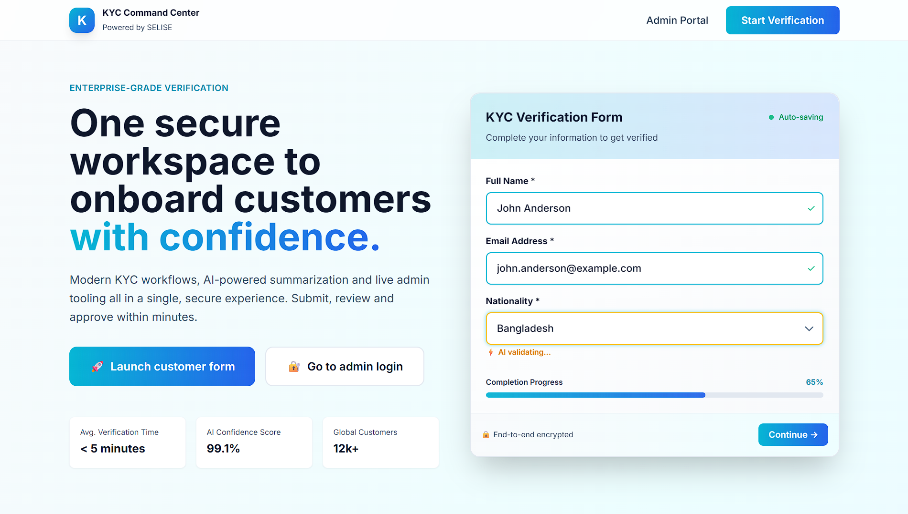
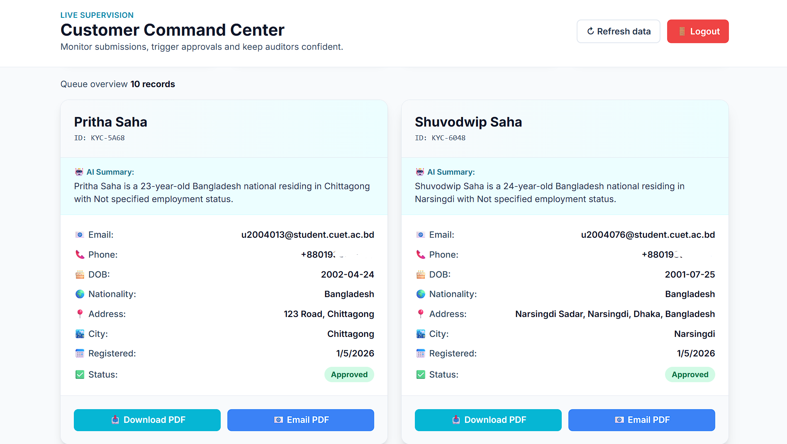
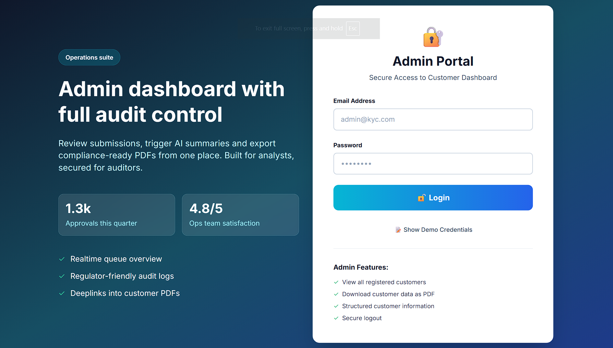

# KYC Verification System 🚀

A modern, full-stack KYC (Know Your Customer) verification platform with AI-powered summarization, real-time processing, and beautiful UI built with React and Node.js.


## ✨ Features

- 🎨 **Modern UI** - Built with Tailwind CSS and smooth animations
- 🤖 **AI-Powered Summaries** - Automated customer data summarization using Hugging Face LLMs
- 📊 **Admin Dashboard** - Comprehensive customer management with real-time stats
- 📧 **Email Integration** - Automated PDF generation and email delivery
- 🔒 **Secure** - JWT authentication and encrypted data storage
- 💾 **Flexible Storage** - MongoDB Atlas with JSON fallback
- 🐰 **Message Queue** - RabbitMQ for asynchronous job processing
- 📱 **Responsive Design** - Works seamlessly on all devices

## 📸 Screenshots

### Landing Page

*Modern landing page with animated form preview*

### Customer Form

*Clean, user-friendly KYC submission form*

### Admin Dashboard

*Comprehensive admin panel with customer management*

### Admin Login

*Secure admin authentication*

## 🛠️ Tech Stack

### Frontend
- **React 18** with TypeScript
- **Tailwind CSS** for styling
- **Vite** for blazing-fast development
- **React Hook Form** + **Zod** for form validation
- **Axios** for API calls

### Backend
- **Node.js** + **Express** with TypeScript
- **MongoDB Atlas** for cloud database
- **RabbitMQ** for message queuing
- **Hugging Face API** for AI summaries
- **PDFKit** for PDF generation
- **Nodemailer** for email delivery
- **JWT** for authentication

## 📋 Prerequisites

- **Node.js** >= 18.0.0
- **Docker Desktop** (for RabbitMQ)
- **MongoDB Atlas Account** (or local MongoDB)
- **Hugging Face API Key** (for AI features)

## 🚀 Quick Start

### 1. Clone the Repository

```bash
git clone https://github.com/YOUR_USERNAME/KYC-project.git
cd KYC-project
```

### 2. Backend Setup

```bash
cd backend
npm install
```

Create a `.env` file in the `backend` directory:

```env
# Server Configuration
PORT=5000
NODE_ENV=development
CORS_ORIGIN=http://localhost:5173

# MongoDB Configuration
MONGODB_URI=your_mongodb_atlas_connection_string
MONGODB_DB_NAME=kyc_database

# LLM Configuration
LLM_PROVIDER=huggingface
HUGGINGFACE_API_KEY=your_huggingface_api_key
HUGGINGFACE_MODEL=mistralai/Mistral-7B-Instruct-v0.2

# RabbitMQ Configuration
RABBITMQ_URL=amqp://localhost:5672

# Email Configuration (Gmail)
MAIL_HOST=smtp.gmail.com
MAIL_PORT=587
MAIL_USER=your_email@gmail.com
MAIL_PASS=your_app_password
MAIL_FROM=your_email@gmail.com
```

### 3. Frontend Setup

```bash
cd ..
npm install
```

### 4. Start Services

**Terminal 1 - RabbitMQ (Docker):**
```bash
docker run -d --name rabbitmq -p 5672:5672 -p 15672:15672 rabbitmq:3.13-management
```

**Terminal 2 - Backend Server:**
```bash
cd backend
npm run dev
```

**Terminal 3 - PDF Worker:**
```bash
cd backend
npm run worker:pdf
```

**Terminal 4 - Frontend:**
```bash
npm run dev
```

### 5. Access the Application

- **Frontend**: http://localhost:5173
- **Backend API**: http://localhost:5000
- **RabbitMQ Management**: http://localhost:15672 (guest/guest)

## 📖 Usage

### Customer Workflow

1. Navigate to http://localhost:5173
2. Click "Start Verification"
3. Fill out the KYC form
4. Submit and receive confirmation with submission ID

### Admin Workflow

1. Click "Admin Login"
2. Login with:
   - Email: `admin@kyc.com`
   - Password: `admin123`
3. View, approve, or reject submissions
4. Download/email PDF reports

## 🔧 Configuration

### MongoDB Atlas Setup

1. Create account at [MongoDB Atlas](https://www.mongodb.com/cloud/atlas)
2. Create a cluster and database user
3. Whitelist your IP (or 0.0.0.0/0 for development)
4. Copy connection string to `MONGODB_URI`

### Hugging Face API

1. Sign up at [Hugging Face](https://huggingface.co/)
2. Generate API token from Settings > Access Tokens
3. Add to `HUGGINGFACE_API_KEY`

### Gmail SMTP

1. Enable 2FA on Google Account
2. Generate App Password: Account > Security > App Passwords
3. Use app password in `MAIL_PASS`

## 📁 Project Structure

```
KYC-project/
├── backend/                 # Backend API
│   ├── src/
│   │   ├── controllers/     # Request handlers
│   │   ├── routes/          # API routes
│   │   ├── services/        # Business logic
│   │   ├── queues/          # RabbitMQ queues
│   │   ├── workers/         # Background workers
│   │   └── index.ts         # Entry point
│   └── package.json
├── src/                     # Frontend React app
│   ├── pages/               # Page components
│   ├── services/            # API services
│   └── index.css            # Tailwind styles
├── tailwind.config.js       # Tailwind config
└── package.json
```

## 🔌 API Endpoints

### Public
- `POST /api/kyc/submit` - Submit KYC form
- `POST /api/auth/login` - Admin login

### Protected (Require JWT)
- `GET /api/kyc/all` - Get all submissions
- `GET /api/kyc/:id` - Get submission by ID
- `PUT /api/kyc/approve/:id` - Approve submission
- `PUT /api/kyc/reject/:id` - Reject submission
- `DELETE /api/kyc/delete/:id` - Delete submission
- `GET /api/kyc/export/:id` - Download PDF
- `POST /api/kyc/export/:id/email` - Email PDF

## 🧪 Testing

1. Fill customer form with sample data
2. Login as admin
3. Approve/reject submissions
4. Download/email PDFs

## 🐛 Troubleshooting

**MongoDB Connection Issues:**
- Verify IP whitelist in MongoDB Atlas
- Check connection string format

**RabbitMQ Connection Failed:**
- Ensure Docker is running: `docker ps`
- Start RabbitMQ: `docker start rabbitmq`

**Frontend Build Errors:**
- Clear cache: `rm -rf node_modules && npm install`

## 🤝 Contributing

1. Fork the repository
2. Create feature branch: `git checkout -b feature/name`
3. Commit changes: `git commit -m 'Add feature'`
4. Push: `git push origin feature/name`
5. Open Pull Request

## 📝 License

MIT License - see [LICENSE](LICENSE) file

## 👥 Author

**Your Name**
- GitHub: [@Shuvodwip](https://github.com/Shuvodwip)

## 🙏 Acknowledgments

- Tailwind CSS
- Hugging Face
- MongoDB Atlas
- RabbitMQ
- SELISE

---

**Built with ❤️ using React, Node.js, and AI**
